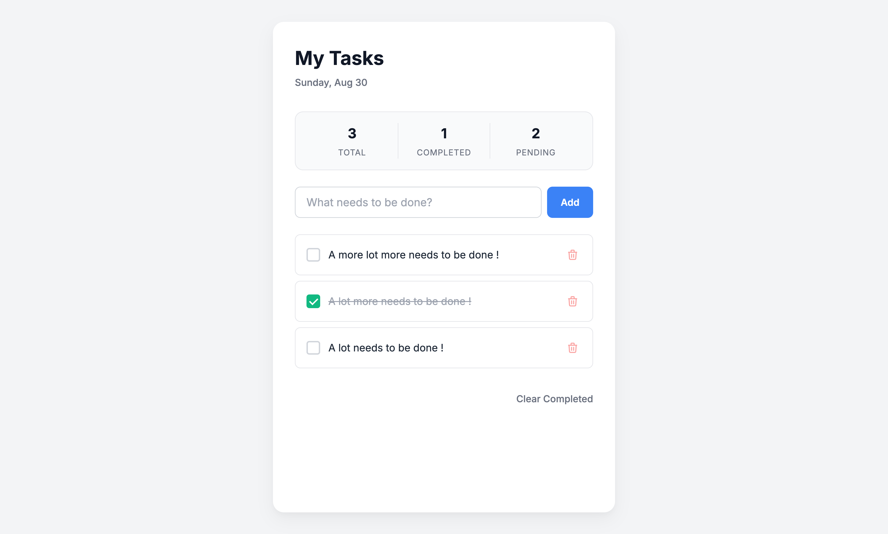

# My Tasks

A single-page to-do app that gets out of your way. Type a task, tick it, come back tomorrow and it is still there.

**Live:** [https://to-do-lake-chi-25.vercel.app/]

---

## What this is

My Tasks is a lightweight task list built with HTML, CSS and vanilla JavaScript. It has no accounts, no backend and no setup. Tasks are saved in the browser using `localStorage`, so they survive a refresh or a restart.

This is my first Ship Log project for the [Dev and Design](https://devanddesign.co) Ship & Found bootcamp (Builder Track). I am a Product & UI/UX Designer with 3+ years of experience, and this is the first working app I have built and deployed myself.

## Who it is for

Me, first. I needed something simpler than the task apps I already had. Secondarily, anyone who wants a task list with zero friction and does not care about projects, tags or reminders.

## The problem it solves

Most to-do apps ask you to organise before you have even written anything down. The core user goal here is narrow on purpose: **write a task down in under five seconds and see it again tomorrow.** Every decision below was measured against that.

## Tools and technologies

| Tool | Why |
|---|---|
| HTML, CSS, JavaScript | The class tech-stack guide recommends this for lightweight, no-login projects. A framework would be over-engineering. |
| `localStorage` | Persistence without a database. |
| Antigravity IDE + AI agent | Scaffolding, refinement pass, Git operations through natural language. |
| Git + GitHub | Version control and cloud backup. |
| Vercel | Hosting. Connected once to GitHub, then every push deploys. |

## How it was built

I followed the product development roadmap from class rather than one big prompt:

1. **Raw idea** – "a to-do dashboard." Built v1.0 on 18 Aug 2026 from a single basic prompt. It worked, but it looked like a demo.
2. **Refine the idea** – Audited v1.0 against the core user goal. Found: no brand, one-state buttons, no empty state, accepted empty tasks, weak keyboard support.
3. **PRD** – Wrote [`PRD.md`](./PRD.md) to fix scope before touching code. Also wrote down what I would *not* build.
4. **Context engineering** – Wrote [`AGENTS.md`](./AGENTS.md) so the AI agent works within the same constraints I would give a developer.
5. **Build** – Ran one engineered prompt for the v1.1 refinement pass, reviewed the plan first, then approved.
6. **Deploy** – Pushed to GitHub, Vercel redeployed automatically.

## Decisions I made

- **No framework.** There is no backend, auth or shared data. HTML/CSS/JS keeps it fast and cheap to host, and I can read every line.
- **Plain CSS, no variables, no Tailwind.** I wanted to understand exactly what each rule does instead of trusting a utility class.
- **Filters (All / Active / Completed) instead of due dates.** Filters help the core goal (see what is left). Due dates add a decision at input time, which slows it down.
- **Block empty tasks.** v1.0 let you add a blank task. That is a bug dressed as a feature.
- **Accessibility as a feature, not a fix.** Visible focus rings, a live region for the counters, labelled controls, keyboard-only usability. In class we audited AI-generated code and found these are the first things agents leave out.

## Challenges and how I solved them

- **Permission errors during setup.** Installing global tools on macOS failed until I ran the commands with the right privileges (`sudo`). Lesson: read the error, do not just retry.
- **Getting the agent to refine, not rebuild.** My first instinct was a short prompt like "make it look better." That produces a rewrite. Writing a structured prompt (role, context, task, constraints, output format) and pointing the agent at `AGENTS.md` kept the existing `localStorage` logic intact.
- **Knowing when to stop.** Every feature I thought of sounded useful. The PRD's out-of-scope list is what kept this shippable in one evening.

## What I would do next

- Inline edit of a task.
- Export tasks to a text file.
- Then, and only then, think about sync.

## Project journal

Day-by-day notes are in [`journal.md`](./journal.md).

---

Built by [Gbolahan Adekola](https://x.com/DEVDESIGNAGE) · #BuildInPublic
